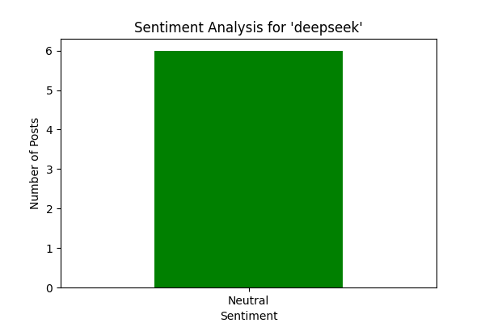

cat <<EOL > README.md
# 📊 Reddit Sentiment Analysis Project

This project performs **Sentiment Analysis** on Reddit data by:
- Scraping **Reddit posts** on a given topic
- Preprocessing text using **TF-IDF**
- Classifying sentiment using a **LSTM Deep Learning model**
- Visualizing sentiment trends in a **Flask web app**
- Deploying on **AWS / Heroku**

---

## 🚀 Features
✅ Collects **live Reddit posts** from subreddits  
✅ Cleans & processes text data  
✅ Uses **TF-IDF & LSTM Model** for sentiment classification  
✅ Provides a **Flask-based web app** for visualization  
✅ Supports **real-time sentiment tracking**  

---

## 📂 Project Structure
\`\`\`
SentimentAnalysisProject/
│
├── data/                    # Stores raw & processed data
│   ├── cleaned_posts.csv      
│   ├── sentiment_history.csv  
│   ├── technology_posts.csv  
│   ├── tfidf_matrix.npy      
│
├── models/                  # Stores trained ML models
│   ├── lstm_model.h5        
│
├── scripts/                 # Python scripts for each phase
│   ├── collect_reddit_data.py   
│   ├── preprocess_data.py       
│   ├── train_model.py           
│   ├── deploy_app.py            
│
├── templates/               # Frontend HTML files
│   ├── index.html
│
├── requirements.txt         # Dependencies
├── README.md                # Project documentation
├── Procfile                 # Deployment file for Heroku
└── app.py                   # Flask app entry point
\`\`\`

---

## 🛠️ Installation
1️⃣ **Clone the repository**
   \`\`\`bash
   git clone <your-repo-url>
   cd Reddit-Sentiment-Analysis
   \`\`\`

2️⃣ **Install dependencies**
   \`\`\`bash
   pip install -r requirements.txt
   \`\`\`

3️⃣ **Run locally**
   \`\`\`bash
   python scripts/deploy_app.py
   \`\`\`

---

## 🌎 Deployment (Heroku & AWS)
**To deploy on Heroku**:
\`\`\`bash
heroku login
heroku create sentiment-analysis-app
git push heroku main
heroku open
\`\`\`

**To deploy on AWS (EC2)**:
\`\`\`bash
ssh -i your-key.pem ubuntu@your-ec2-ip
cd SentimentAnalysisProject
python3 -m venv venv
source venv/bin/activate
pip install -r requirements.txt
gunicorn --bind 0.0.0.0:5000 scripts.deploy_app:app
\`\`\`

---

## 📊 Example Screenshot

---

## 🤝 Contributing
1. **Fork the repo**
2. **Create a new branch** (\`feature-branch\`)
3. **Commit your changes**
4. **Push and submit a PR**

---
